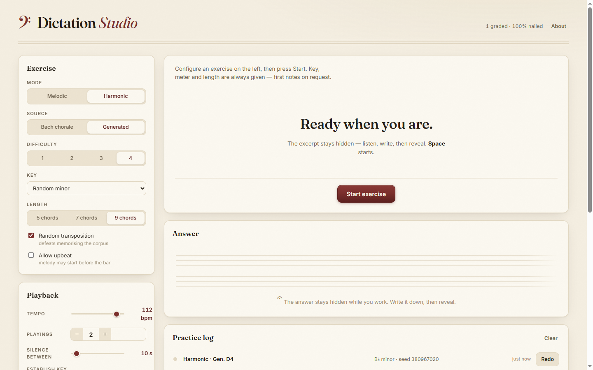

# Dictation Studio

A static website for practicing **melodic and harmonic dictation** — built for grad-school
entrance-exam preparation. Excerpts come from **366 real Bach chorales** or from a
**rule-based four-part writing generator**, played under exam conditions: the key is
established, the excerpt is played a set number of times with silent writing gaps, and the
engraved answer stays hidden until you reveal it.



## Quick start

No build, no server, no network needed:

1. **Double-click `index.html`** — that's it. (Or host the folder on any static server / GitHub Pages.)
2. Pick a mode and press **Start**.

Everything (chorale data, notation engine, fonts) is bundled locally, so it works offline.

## What it does

| | Melodic dictation | Harmonic dictation |
|---|---|---|
| **Bach chorales** | soprano or bass lines of real phrases | full SATB phrases; answer is the engraved score |
| **Generated** | rule-based melodies, difficulty 1–4 | four-part progressions with **Roman numeral answers**, difficulty 1–4 |

**Generated difficulty ladder (harmonic):** 1 = I/IV/V/V7 + cadences · 2 = ii, inversions,
cadential 6/4, vii°6 · 3 = secondary dominants, tonicized mediant, deceptive cadences, Phrygian
half cadence · 4 = mode mixture, Neapolitan 6, Italian/French/German augmented sixths, vii°7.

Generated four-part writing is also embellished with **non-chord tones** — passing tones,
neighbor tones and escape tones (diatonic and chromatic), woven in as off-beat eighths and
scaled by difficulty — so it sounds like real chorale writing rather than block chords.

Every generated exercise passes a hard voice-leading validator (ranges, spacing, no
parallel/hidden perfects, tendency-tone resolution, doubling rules), and the non-chord-tone
pass is checked to introduce no new parallels — soak-tested over thousands of seeds with zero
violations.

### Exam-style practice controls

- **Sound**: a real sampled **piano** (default) or the built-in **synth** voice
- **Playings** (1–10) with a **timed silent gap** between them (countdown ring, skippable)
- **Establish the key** first: I–IV–V7–I plus the tonic (off / once / before every playing)
- Count-in clicks, tempo 40–120 BPM, fermatas held chorale-style
- **Voices played**: pick any combination of soprano / alto / tenor / bass (scaffold harmonic hearing)
- Givens shown like an exam: key, meter, length — first note(s) behind a "peek"
- **Random transposition** of Bach excerpts (range-safe, properly respelled) so you can't memorize the corpus
- Auto-reveal after a final writing gap, or reveal manually (`R`)

### After the reveal

Engraved notation (abcjs), Roman numerals for generated harmonic exercises, per-voice
mute/solo replay, source info (BWV + title + transposition, or seed), self-grading
(Nailed it / Close / Missed), and a **practice log** with one-click **Redo** that rebuilds the
exact same exercise. Settings, presets, history and stats persist in your browser.

### Keyboard

`Space` start/stop · `P` play again · `S` skip wait · `R` reveal · `N` new exercise

## Project layout

```
index.html  css/  fonts/          UI shell, design system, vendored fonts (OFL)
js/*.js                           app modules on window.DS (no build step)
js/vendor/abcjs-basic-min.js      notation engraving (MIT)
js/data/chorales-data.js          366 chorales, generated by the pipeline below
tools/                            data pipeline + node test suite
docs/superpowers/                 design spec & implementation plan
```

## Development

```bash
node tools/test/run.mjs            # full test suite (theory, generators, NCTs, kern, ABC, timing)
node tools/fetch-chorales.mjs      # re-download the kern corpus into tools/cache/
node tools/build-chorales.mjs      # rebuild js/data/chorales-data.js from the corpus
node tools/fetch-fonts.mjs         # re-vendor fonts
node tools/fetch-piano.mjs         # re-vendor the embedded piano samples
```

The kern pipeline parses the corpus (pitches, durations, ties, fermatas, modal keys),
validates every measure across all four voices, extracts fermata-delimited phrases, and
buckets them into difficulty terciles by chromaticism, rhythm and leap density.
366 of 370 chorales survive validation.

## Licences & attribution

- **Chorale encodings:** [craigsapp/bach-370-chorales](https://github.com/craigsapp/bach-370-chorales),
  © 2009 Craig Stuart Sapp, **CC BY-NC-SA 4.0**. The derived `js/data/chorales-data.js`
  inherits that licence. The music itself is public domain.
- **abcjs** — MIT. **Fraunces, Inter, Noto Music** — SIL Open Font License.
- **Piano samples:** acoustic grand piano from the **FluidR3_GM** soundfont via
  [gleitz/midi-js-soundfonts](https://github.com/gleitz/midi-js-soundfonts) (MIT), embedded
  in `js/data/piano-samples.js`.
- App code: MIT. This is a personal practice tool; the bundled chorale data keeps the
  overall bundle non-commercial (BY-NC-SA).
